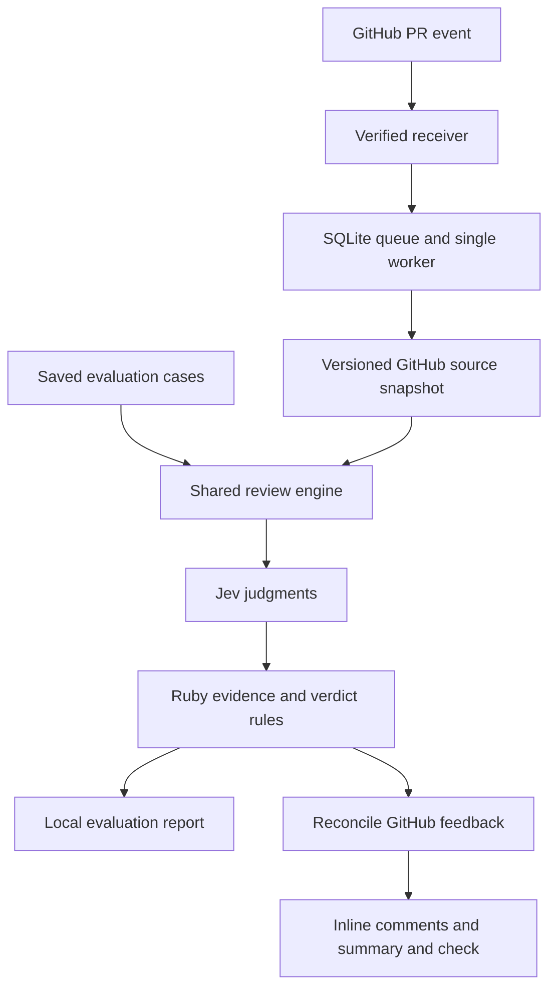

# feat: Build and evaluate Slop Guard

**Primary target:** `slop-guard`. Paths below are relative to that repository unless a unit explicitly names the separate `log-parser` demo repository (currently supplied as `log-parser-master`).

## Overview and Problem Frame

Build a small Ruby GitHub App that reviews log-parser PRs against four explicit guidelines: observable behavior tests (G1), relevant failure-case tests (G2), focused responsibilities (G3), and justified abstractions (G4). Findings are advisory, appear inline where possible, and cite the applicable guideline and evidence. Jev supplies bounded judgments; Ruby owns context selection, thresholds, explanations, and GitHub actions.

Prove review quality before investing in GitHub delivery. Phase A qualifies the four rules using saved patches and live Jev evaluations. Phase B connects the same engine to GitHub and demonstrates opening a PR, receiving feedback, fixing the issue, and seeing the review update. A working webhook is not evidence of a useful reviewer.

The user selected the GitHub App architecture, one Ruby demo project, advisory feedback, inline comments plus a summary, and all four guidelines (see origin: `docs/brainstorms/2026-09-19-slop-guard-demo-requirements.md`). Feature-to-test coverage and explicit guideline provenance extend the slopcheck article; their feasibility remains an evaluation question.

## Requirements Trace

| Origin requirement | Implementation and verification |
|---|---|
| R1: PR events and identified commit | Units 5-7: fresh PR snapshots, versioned runs, head-specific checks |
| R2: diff and relevant source/test context | Units 2 and 5: complete bounded demo corpus and change-scoped candidates |
| R3: explicit expected behavior | Units 1-3: PR template, enumerated scenarios, ambiguity handling |
| R4: existing tests and incomplete evidence | Units 2-4: corpus manifest, unsupported-pattern detection, negative controls |
| R5: trusted versioned atomic questions | Unit 3: four maintained rule definitions, no generated rules |
| R6: inline evidence, explanations and readings | Units 3 and 7: deterministic findings, locations and report rendering |
| R7: advisory only | Units 7-8: COMMENT reviews, non-required checks, no approval or edits |
| R8: transparent coverage and outcomes | Units 3 and 7: separate findings, coverage and run status |
| R9: updates, deduplication and stale results | Units 6-7: revision identity, publication ledger and reconciliation |
| R10: empty, partial and failed reviews | Units 2-7: explicit terminal outcomes and bounded retries |
| R11: labeled patches | Units 1 and 4: development corpus and independent holdout families |
| R12: evaluation, frozen versions and metrics | Unit 4: measured thresholds and qualification report |
| R13: actual GitHub demonstration | Unit 8: recorded live PR/fix cycle and operational failures |
| R14: trusted integration boundary | Units 5-8: scoped installation, verified webhooks, data-only source inspection |

## Scope Boundaries

One installed demo repository; no dashboard, arbitrary guideline ingestion, general agent framework, automatic fixes, automatic approval, merge blocking, or other languages. Do not replicate lint or claim that reading a test proves it passes. Review only concerns caused or exposed by the PR; unchanged source is context, not an invitation to audit the project.

Existing source examples from `api-main` inform the four adapted guidelines. They are not runtime dependencies and do not introduce Rails, databases, or adapter frameworks into log-parser. No proprietary `api-main` source or fixtures enter the evaluation corpus or model requests.

### Work in the Separate Demo Repository

Unit 1 establishes log-parser's runtime, baseline, adopted guidelines and PR template. Unit 8 creates controlled demo PRs there. These are part of this milestone but must remain isolated from the bot's source and credentials. Preserve the original supplied project; make compatibility changes explicit in the demo baseline.

## Context and Research

### Local Evidence

- Slop Guard has the origin document but no application, manifest, deployment configuration, local guidance or `docs/solutions/` learnings. Its directory and the supplied parser directory were not Git checkouts when inspected. Do not invent remotes or overwrite an existing remote during setup.
- Log-parser's `Gemfile` pins Ruby 2.6.5; `Gemfile.lock` contains RSpec 3.10 and RuboCop 1.21. `lib/file_reader/parser.rb` reads log lines, `lib/path_tracker/page.rb` counts visits, `lib/path_tracker/pages.rb` groups/sorts pages, and `lib/presenters/pages_presenter.rb` formats results. These boundaries give G3 concrete project context.
- Source and tests under the inspected Ruby paths total approximately 19 KB before numbering/context metadata. This supports inspecting the whole small corpus instead of building semantic retrieval.
- `spec/tests/file_reader/parser_spec.rb` checks page count and a nil-file error; it does not by itself establish all unique-visitor behavior. Other specs must be included before concluding a scenario is absent.
- Source observation to characterize: `bin/log_parser.rb` rescues the `Errors::FileParsing` module, while exception classes inherit `Errors::FileParsing::Base`. No failure path has been executed in planning. Establish CLI behavior before using it as a labeled example.
- The adopted guideline sources are recorded in the origin: `api-main`'s `docs/adapter-pattern.md`, `.github/PULL_REQUEST_TEMPLATE.md`, and `.rubocop.yml`. The separately linked primary engineering documentation was unavailable.

### External Contracts Checked

- [Jev models](https://docs.typesafe.ai/models): pinned ID `jev-1.13.0`, 64k total request tokens, 32k for state plus the longest question, and published input price of $0.042/M tokens. Alias targets and limits can change.
- [Jev API](https://docs.typesafe.ai/api): direct HTTP requests containing state and typed questions; handle validation errors, 429, 529, and invalid/missing answers explicitly. No Ruby SDK is assumed.
- [Question primitives](https://docs.typesafe.ai/primitives) and [known limitations](https://docs.typesafe.ai/model-jaggedness/jev-1.13): use narrow questions; independent answers need not obey arithmetic identities; untrusted state can influence judgments.
- [GitHub webhook guidance](https://docs.github.com/en/webhooks/using-webhooks/best-practices-for-using-webhooks) requires prompt acknowledgement; [signature validation](https://docs.github.com/en/webhooks/using-webhooks/validating-webhook-deliveries) authenticates raw deliveries.
- [GitHub API versioning](https://docs.github.com/en/rest/about-the-rest-api/api-versions): choose `2026-03-10` explicitly. The reviewed docs list it as supported. No retirement notice was found for the selected Jev endpoint; absence of a notice is not a service guarantee.
- [Ruby releases](https://www.ruby-lang.org/en/downloads/releases/) and [Sinatra](https://sinatrarb.com/intro.html) support selecting Ruby 3.4 with Sinatra 4. Pin an available patched release and resolved dependencies during implementation rather than assuming log-parser's old runtime is suitable for the bot.
- [Prism](https://ruby.github.io/prism/) provides Ruby syntax parsing and source locations. [SQLite WAL](https://www.sqlite.org/wal.html) fits two processes on one machine with a local persistent volume; it is not a multi-host storage design.

## Key Technical Decisions

| Decision | Rationale and limit |
|---|---|
| Ruby 3.4, Sinatra 4/Puma, RSpec | Small webhook service and familiar tests; no Rails application is needed. Exact patches are locked during implementation. |
| A reusable Ruby engine invoked locally and by a worker | Evaluations exercise the same context building, questions and verdict logic used on GitHub. Only the source loader differs. |
| Full bounded demo source/test corpus | Fewer unseen-caller and unseen-test errors than diff-only review. Overflow causes abstention; no vector database or ranking system. |
| Prism for syntax candidates; Jev for semantics | A parser finds class/method/spec locations without executing code. It cannot prove dynamic Ruby behavior; unsupported constructs remain coverage gaps. |
| Four trusted rule files in the bot release | Project guideline text and criteria are adopted deliberately. PR changes cannot redefine the rules that judge that PR. |
| HTTP Jev client with pinned model | Avoid an invented Ruby SDK and isolate request/answer validation. Nouls suffice initially; no generated prose or text-producing model. |
| SQLite run queue and one worker | Acknowledged work survives process restart without a second service such as Redis. No horizontal scaling in the demo. |
| Local container deployment behind HTTPS forwarding | One machine runs the receiver and worker, sharing persistent local storage. Public hosting and multi-tenant operations are not prerequisites. |
| GitHub App installation tokens | Repository-scoped reads and review publication; no developer personal token or write access to source. |

### Context and Decision Contract

The trusted demo profile includes Ruby source in `lib/` and `bin/`, all Ruby files under `spec/` (including nonstandard names), `.rspec`, and the approved small text fixtures needed by those tests. Fetch full head versions; fetch before versions of changed/deleted Ruby files for attribution. Exclude generated coverage, dependencies and unrelated logs. Read configuration as data, never load Ruby or execute spec setup. If code refers to missing helpers, external fixtures, unsupported shared-example expansion, or dynamic tests whose meaning cannot be established, mark the affected coverage inconclusive.

The demo PR template includes the required short Before/After description plus flat bullets under `Expected behavior` and `Failure cases`. Parse those bullets while retaining Before/After as purpose and change context. Preserve the author's exact text and stable scenario identifiers. Empty, contradictory or compound scenarios are reported for clarification rather than silently rewritten. G1 applies to the relevant behavior bullets and G2 to documented error scenarios and established error contracts affected by the change. G3/G4 can run even when feature expectations are absent.

For this small repository, number source lines and enumerate candidate tests, methods and classes from the parsed syntax tree. Include RSpec setup, enclosing contexts and referenced helpers, not isolated assertion lines. Identify changed spans separately so existing tests can provide evidence without generating unrelated findings.

| Rule | Question strategy | Evidence needed before finding a concern |
|---|---|---|
| G1 | For each behavior, ask whether a supplied test exercises production behavior and asserts that result. Also ask whether the supplied test corpus lacks that behavior check. | Complete relevant test context; a strong missing-coverage judgment consistent with the per-test judgments. A conflicting positive test reading is inconclusive, not ignored. |
| G2 | Apply the same approach to each relevant documented failure scenario: is the expected failure outcome asserted? | An identified applicable error scenario, affected code, and complete relevant tests. No finding merely because a file has no new failure test. |
| G3 | For each changed method/class, ask whether the change mixes each predefined responsibility pair: parsing/counting/presentation. Ask separately whether that combination is justified by the established boundary or orchestration role. | A concrete changed candidate, the identified responsibilities and observable consequence, and evidence against a legitimate orchestration explanation. The CLI may coordinate components. Mere coexistence of responsibilities does not justify demanding a new class. |
| G4 | For each new layer, ask whether it is an abstraction, whether it has demonstrated consumers/implementations, and whether it serves an explicit present constraint. | Full relevant caller context and consistent evidence of speculative purpose. Dependency injection, isolation and framework contracts are explicit exceptions to assess. |

These are directions for writing and evaluating questions, not validated prompts. Whole-context and candidate answers must agree before emitting a location-specific concern. A strong whole-context concern without a locatable candidate is a coverage gap. Combine readings as named policy conditions rather than calling the result a joint probability. Preserve every input reading used in a decision.

Start development with high/low candidate thresholds of 0.85/0.20 solely as experimental values. Evaluate alternatives on the development set; freeze per-rule thresholds only after measurement. Conflicting signals or values between decision bands are inconclusive. Applicability, evidence completeness and semantic judgment are separate fields. A rule can have a supported concern for one candidate and incomplete coverage for another; the report must show both.

### Operational Limits

Initial engineering bounds: 50 changed files, 100 inspected files, 16 KiB per text file, 12 behavior/failure scenarios total, and 100 candidate tests. Bound both serialized state-plus-longest-question (28 KiB) and complete request payload (56 KiB). These are conservative byte limits, not claims about the provider's tokenizer; a provider context rejection still produces an explicit coverage failure. Split independent questions while retaining their required context. Never fragment a test body to make a missing-test claim fit.

Allow at most 20 Jev attempts per review, including retries, with a 120-second processing deadline and per-call connection/read timeouts. Honor retry headers for recoverable errors within that deadline; do not retry bad credentials or invalid questions. Reserve cost against the maximum request-token allowance before dispatch; show actual billed usage separately. Initial ceilings: $0.10 per review and $2 per explicitly started local evaluation session. These are configurable stop limits, not authorization to make paid calls during planning. Freeze them with the evaluation configuration and revise only with a recorded reason.

The hosted worker persists attempt counts and cost reservations before requests; local evaluation keeps an append-only session ledger. A timeout or crash with unknown provider usage retains its reservation. Recovery must not reset a review's deadline, retry allowance or budget. Stop conservatively when remaining allowance cannot cover another request.

## Evaluation Plan and Release Gates

### Dataset and Ground Truth

Create examples before tuning. Each case stores a clean baseline reference, patch, PR expectations, complete source/test context, expected guideline outcomes, acceptable evidence anchors, forbidden findings, and a short human rationale. Expected labels are held separately from model state. Ordinary positive and negative cases must contain adequate evidence; incomplete-context cases are a distinct class.

Start with 16 development cases: for each guideline, one violation, one legitimate lookalike, one fix, and one incomplete-context case. Construct 8 additional held-out cases: a positive and a negative for each guideline, with different feature/implementation families. Do not split a defect and its fix across development and holdout. Labels describe every applicable guideline so an unexpected finding cannot be excused as an unlabeled side effect.

| Guideline | Example violation | Legitimate control | Fixed variant |
|---|---|---|---|
| G1 | Unique-visitor feature tests only the number of pages or a stubbed count | Real repeated-IP assertion already exists outside the diff | Add the missing production-path assertion |
| G2 | New strict-input behavior promises an error for malformed rows but tests only valid input | Documented tolerant mode intentionally skips invalid rows, with its behavior tested | Add the malformed-row error assertion |
| G3 | A new counting method builds terminal formatting and prints output | CLI coordinates counting and presentation through their public interfaces | Move presentation behavior into the existing presenter |
| G4 | One output format gains a factory/registry/strategy hierarchy without a present need | Two existing format consumers or a documented isolation boundary justify the layer | Use the concrete formatter or establish the actual required boundary |

Validate that labels are defensible from the supplied evidence and that the demo baseline runs before freezing cases. Source expectations come from the guideline and feature contract, not another model's agreement. The maintainer reviews disputed labels. Small deterministic fixture checks catch invalid anchors, missing files, overlapping dataset families and expected-label leakage.

### Measurements

- Report raw counts and precision of emitted concerns (correct concerns / all emitted concerns), plus recall against labeled violations (correct concerns / all labeled violations). Inconclusive results on answerable positive cases remain unresolved misses in recall, not removed from its denominator.
- Report correct abstention on incomplete cases and unnecessary abstention on answerable cases separately, with counts by rule and reason. This prevents a reviewer that abstains on everything from appearing accurate.
- Match a finding on guideline, intended concern/scenario and allowed anchor, not just the presence of any comment. Wrong-location or wrong-reason findings fail the case. Record extra findings as false positives.
- Run the frozen holdout three times with actual new Jev requests, no answer cache or majority-vote masking. Report outcome flips, probability ranges, cost, total elapsed time, and relevant dependency versions.
- Retain failed evaluation runs. If holdout examples are inspected to tune rules, retire those families into development and create fresh held-out examples before declaring a new pass. Passing 8 small cases is demo evidence, not an estimate of general production accuracy.

### Gates

1. **Baseline gate:** log-parser's selected baseline has documented test/lint results and stable behavior; fixtures and human labels pass validation.
2. **Rule gate:** all four guidelines satisfy their agreed development outcomes and both held-out outcomes in all three runs, with correct evidence and no extra accusations. Incomplete cases abstain correctly. Freeze model, rules, context-builder version and thresholds. If a rule fails, stop the four-rule demo qualification, report the failure, and revise/evaluate; do not silently drop a selected guideline or substitute canned live answers.
3. **Delivery gate:** automated integration tests verify authenticated ingestion, durable work, duplicate/restart recovery, same-SHA description changes, new-head cancellation, publication reconciliation and partial failures.
4. **Live gate:** a real GitHub PR and fix produce the expected live review cycle. Separately demonstrate an incomplete-context case and an injected provider failure. Preserve run IDs, head SHAs, report versions and links as evidence.

## High-Level Technical Design

> This illustrates the intended approach and is directional guidance for review, not implementation specification. The implementing agent should treat it as context, not code to reproduce.



The local and hosted paths use identical engine inputs. The GitHub path alone has credentials for publication. Evaluation needs only the Jev key; deterministic CI tests need neither provider nor GitHub secrets.

## Output Structure

This is the expected shape, not a requirement to introduce a class for every file. Unit file lists are authoritative; use ordinary Ruby objects and no generic plugin architecture.

```text
bin/                         review, evaluate, worker
lib/slop_guard/               snapshot, candidates, rules, evaluator, report
lib/slop_guard/               jev_client, github_client, github_source
lib/slop_guard/               webhook_app, store, worker, publisher
config/                      four rule definitions and demo profile
db/                          initial SQLite schema
eval/                        baselines, development, holdout, manifests
spec/                        engine and integration specifications
docs/                        guidelines, evaluation, setup and demo instructions
.github/workflows/           tests and container build
Dockerfile, compose.yml       demo runtime and persistent volume
```

## Implementation Units

### Phase A: Validate the Reviewer

- [ ] **Unit 1: Establish the demo baseline and labeled cases**

**Goal:** Make the expected behavior and guideline judgments explicit before prompt design.

**Requirements:** R3, R5, R11, R12; all four guideline definitions.

**Dependencies:** None. Confirm GitHub repository identities with the maintainer during setup; no credentials are needed to author local cases.

**Files:**

- Slop Guard: `README.md`, `Gemfile`, `Gemfile.lock`, `.ruby-version`, `.gitignore`, `.env.example`, `docs/guidelines.md`, `docs/evaluation.md`, `config/demo.yml`, `eval/baselines/`, `eval/development/`, `eval/holdout/`, `eval/manifest.yml`.
- Tests: `spec/eval/fixture_contract_spec.rb`.
- Separate log-parser repo: `Gemfile`, `Gemfile.lock`, `.ruby-version`, `README.md`, `docs/engineering-guidelines.md`, `.github/PULL_REQUEST_TEMPLATE.md`; characterization in `spec/tests/cli/log_parser_spec.rb` and relevant existing specs.

**Approach:** Use Ruby 3.4 for the bot. Characterize the supplied parser behavior first, then establish an explicit Ruby 3.4 demo baseline with only necessary dependency/compatibility changes. If baseline errors are reproduced, fix them separately before introducing labeled defects; record what changed. Copy adapted guidelines, not company-specific implementation. Fixture authors define all expected outcomes before observing model scores.

**Patterns:** log-parser's `spec/tests/` organization and actual parser/counting/presenter boundaries; the origin's source provenance.

**Execution note:** Characterization-first for the legacy CLI; fixture labels before model tuning.

**Test scenarios:** repeated IP vs distinct IP visits; same IP on separate pages; valid CLI output and malformed/missing input behavior; fixture with nonexistent evidence line rejected; duplicate case/family across splits rejected; labels absent from serialized model input.

**Verification:** Baseline evidence and the complete 16-case development/8-case holdout manifest exist. No unrecorded behavior change or undeclared known failure is embedded in the benchmark.

- [x] **Unit 2: Build bounded snapshots and Ruby evidence candidates**

**Goal:** Turn saved PR data into complete, traceable evidence without executing it.

**Requirements:** R2-R4, R6, R10, R14.

**Dependencies:** Unit 1.

**Files:** `lib/slop_guard/snapshot.rb`, `lib/slop_guard/candidates.rb`, `lib/slop_guard/expectations.rb`; tests `spec/slop_guard/snapshot_spec.rb`, `spec/slop_guard/candidates_spec.rb`, `spec/slop_guard/expectations_spec.rb`.

**Approach:** Normalize before/head files, diff ranges, PR scenarios, trusted guideline revision and a completeness manifest. Use Prism nodes for class/method/test ranges. Handle nested RSpec contexts and setup in the supplied simple test style; flag unsupported dynamic cases. Parse the controlled template's flat scenario bullets. Anchor candidates using paths, qualified names, scenario identities and source fingerprints rather than line numbers alone. Restrict local fixture reads to the fixture root; reject traversal and symlinks.

**Patterns:** log-parser's RSpec calls and `require_relative` edges; Prism source-location documentation. Parser code locates evidence; it does not judge guideline violations.

**Test scenarios:** existing test outside diff retained; nested setup accompanies assertion; file rename and deletion preserve before/head attribution; line-number shift retains logical candidate identity; parse error, unknown helper or unresolved shared example yields a gap; oversized file/request does not truncate silently; missing/compound expectations are explicit; source strings containing instructions are kept as data.

**Verification:** Every model-visible candidate maps to an actual source range, every omitted dependency is visible in coverage, and no target code is evaluated.

- [x] **Unit 3: Implement Jev questions, validated answers and deterministic findings**

**Goal:** Produce advisory concerns and coverage outcomes from trusted templates.

**Requirements:** R4-R8, R10, R12, R14.

**Dependencies:** Unit 2.

**Files:** `lib/slop_guard/jev_client.rb`, `lib/slop_guard/rules.rb`, `lib/slop_guard/evaluator.rb`, `lib/slop_guard/report.rb`, `config/rules/g1.yml`, `config/rules/g2.yml`, `config/rules/g3.yml`, `config/rules/g4.yml`, `bin/review`; tests `spec/slop_guard/jev_client_spec.rb`, `spec/slop_guard/evaluator_spec.rb`, `spec/slop_guard/report_spec.rb`.

**Approach:** Use HTTP/JSON with strict TLS and timeout handling. Batch independent questions over identical required context; pin the model. Validate expected IDs, answer types, finite numbers in range, model identity and usage before applying rules. Unknown output cannot become a path or API action. Produce machine-readable results and templated Markdown from the same findings. Include individual readings and thresholds without labeling them as proof. Suppress redundant G1/G2 comments for the same missing assertion while preserving both guideline links and separate evaluation attribution.

**Patterns:** TypeSafe's primitives and pre-enumerated evidence cookbook; fixed rules and correction text from the article.

**Test scenarios:** readings above/below/exactly at thresholds; missing test with complete corpus vs unavailable corpus; conflicting whole-context/per-test answers; justified single-consumer abstraction; top-level orchestration accepted; malformed JSON, missing/extra IDs, wrong model, NaN/out-of-range values; 401/422 terminal failure, 429/529 bounded recovery; partial batch failure preserves independent findings; credential and instruction-like input never enter rendered control fields.

**Verification:** Deterministic fixture responses exercise every decision branch; client contract tests do not claim model accuracy. Context, retry, request-count and cost limits are enforced before requests and during recovery.

- [ ] **Unit 4: Evaluate and qualify all four rules**

**Goal:** Establish measured review quality before implementing GitHub delivery.

**Requirements:** R11-R12; rule gate.

**Dependencies:** Units 1-3.

**Files:** `bin/evaluate`, `lib/slop_guard/eval_runner.rb`, `docs/evaluation.md`, `eval/manifest.yml`, frozen rule configuration; tests `spec/eval/runner_spec.rb`, `spec/eval/metrics_spec.rb`. Generated local reports live under ignored `tmp/evaluations/`; commit only a reviewed, secret-free qualification summary.

**Approach:** Compare exact structured outcomes to labels; render per-case discrepancies before aggregates. Capture case family/split, model ID, code/rule/context hashes, configuration, billed tokens, estimated cost and duration. Support deterministic replay for harness tests and a separately explicit live mode. Live qualification performs three complete fresh evaluations per case, including every required question batch, with no answer caching. A held-out failure is reported rather than silently retried until a favorable run appears.

**Patterns:** The Evaluation Plan above is authoritative; no generative model is used as the final ground-truth judge.

**Test scenarios:** false positive on clean code; missing positive; correct vs unnecessary abstention; correct category at wrong location; duplicate findings inflate neither recall nor success; API failure excluded from semantic accuracy but fails completion; label leakage and split contamination rejected; session budget exhaustion stops remaining calls with incomplete status; model/version changes invalidate prior qualification.

**Verification:** Baseline and rule gates pass with documented live evidence, or work stops with specific failed rules and examples. Proceeding with a smaller rule set requires an explicit scope decision.

### Phase B: Deliver Reviews on GitHub

- [ ] **Unit 5: Add GitHub installation authentication and source loading**

**Goal:** Build the same evidence snapshots from a real PR with scoped read access.

**Requirements:** R1-R4, R10, R14.

**Dependencies:** Rule gate from Unit 4.

**Files:** `lib/slop_guard/github_client.rb`, `lib/slop_guard/github_source.rb`, `docs/github-app-setup.md`; tests `spec/slop_guard/github_client_spec.rb`, `spec/slop_guard/github_source_spec.rb`.

**Approach:** Generate short-lived installation credentials using an established JWT library. Use GitHub REST `2026-03-10`, fixed GitHub endpoints and IDs from authenticated data. Permissions: Contents read, Pull requests write, Checks write, and default Metadata read; no source writes or administration. Fetch fresh PR metadata, complete paginated changed-file records, and allowed trees/blobs at recorded immutable revisions. Capture base head, merge-base, PR head, expectation digest and trusted configuration hashes. Re-fetch PR metadata after collection and discard/rebuild a mixed snapshot.

Use the PR's merge-base semantics when attributing changes, not a tip-to-tip comparison that treats base-branch-only changes as the author's work. Missing patches, truncated trees or API caps must invalidate affected coverage. Read removed files from the before revision. Do not follow payload URLs or arbitrary cross-host redirects, and do not install dependencies from the target repository.

Obtain the merge-base from [GitHub's comparison endpoint](https://docs.github.com/en/rest/commits/commits#compare-two-commits) using the captured base/head SHAs. Use that revision for before-source attribution. Keep the paginated PR files response as the changed-file inventory; the comparison endpoint's capped file list is not a completeness guarantee. Cross-check the inventory against the PR's reported changed-file count and the final unchanged base/head identity. A comparison failure or unsupported ancestry prevents an attributed code verdict.

**Patterns:** GitHub installation authentication, PR files and trees/blobs APIs. The fixture loader and GitHub loader produce the Unit 2 contract.

**Test scenarios:** expired token refresh; permission denied/uninstalled App; authorized repository mismatch rejected; multi-page results collected; base/head changes mid-fetch; base-only changes excluded using the merge-base; changed-file count mismatch; binary or missing patch; deleted/renamed file; truncated tree; inaccessible fork head produces incomplete context; source URL spoofing rejected; local fixture and equivalent GitHub snapshot produce matching engine inputs.

**Verification:** Read-only source integration supplies reproducible snapshot identities without executing target code. Token values never persist in snapshots or logs.

- [ ] **Unit 6: Receive authenticated events and process durable runs**

**Goal:** Acknowledge events quickly while reliably scheduling bounded reviews.

**Requirements:** R1, R9-R10, R14.

**Dependencies:** Unit 5.

**Files:** `config.ru`, `lib/slop_guard/webhook_app.rb`, `lib/slop_guard/store.rb`, `lib/slop_guard/worker.rb`, `db/schema.sql`, `bin/worker`; tests `spec/requests/webhooks_spec.rb`, `spec/slop_guard/store_spec.rb`, `spec/integration/review_lifecycle_spec.rb`.

**Approach:** Sinatra verifies the raw-body HMAC with a constant-time comparison, validates installation/repository allowlists and event actions, then durably records the delivery before returning 202. Respond within GitHub's 10-second window; Jev runs only in the worker. Accept relevant opened/reopened/synchronize/edited events; a closed PR cancels queued work. Ignore irrelevant actions and ping without creating review work.

SQLite stores delivery IDs, pending PR requests, immutable run revisions/results, attempt/budget reservations and publication pointers. Use short transactions, WAL, busy timeouts, uniqueness constraints and a single worker process. Each claimed run has a lease; restart recovers expired claims and resumes publication from persisted results without blindly repeating calls. Never keep a write transaction open during network work. Old webhook payloads request a fresh snapshot rather than restoring old PR state. Collapse duplicate/current-equivalent requests by snapshot identity.

Enforce the single-worker assumption with an exclusive process lock on the shared local volume; a second worker exits before claiming work. A run lease alone cannot prevent an older process from publishing after its lease expires. Include accidental second-worker startup in recovery verification.

Run identity includes repository/PR, base and head revisions, expectations digest, rule/profile/context-builder versions and model configuration. A PR description edit with the same head therefore creates a different revision. Store only identifiers and necessary results durably; source bundles remain transient. Config changes require an operator-initiated re-review through the same queue, not an external unauthenticated endpoint.

**Patterns:** GitHub delivery identity and asynchronous acknowledgement; SQLite transaction constraints, not an in-memory queue.

**Test scenarios:** missing/wrong signature or oversized body rejected; duplicate delivery acknowledged once; crash after durable enqueue recovered; database failure returns non-success; duplicate semantic events do not duplicate runs; description edit re-reviews same SHA; out-of-order event fetches current state; new head supersedes old run; worker restart after evaluated state reuses results; lost provider response retains reserved cost; restart cannot reset the deadline or attempt limit; timeout/cancel becomes terminal; uninstall stops further processing.

**Verification:** Automated restart and concurrency scenarios preserve acknowledged work and do not allow two active publishers. No exactly-once external delivery claim is made.

- [ ] **Unit 7: Publish and reconcile advisory feedback**

**Goal:** Show useful line findings and a current summary without duplicate or misleading feedback.

**Requirements:** R6-R10, R14.

**Dependencies:** Unit 6.

**Files:** `lib/slop_guard/publisher.rb`, `lib/slop_guard/report.rb`; tests `spec/slop_guard/publisher_spec.rb`, `spec/integration/publication_recovery_spec.rb`.

**Approach:** Maintain one App-owned issue comment as the PR summary, identified by both author identity and a stable hidden marker. Publish new inline findings in a COMMENT review with explicit commit, path, line and side. Use validated changed lines; otherwise use the summary with immutable source links. Record logical finding IDs independently of line shifts. Edit the bot's previous comment body with current status and latest evidence when the same concern persists; keep its historical anchor clear. Do not delete human replies or auto-resolve human threads. New concerns get new inline anchors, while fixed/inconclusive prior concerns remain traceable from the summary.

Persist each publication intent and discovered remote ID. After an ambiguous write timeout or crash, list App-owned reviews/comments/checks and reconcile markers before retrying. If delivery cannot be established, stop with publication-incomplete status rather than risk a duplicate. Validate current snapshot identity immediately before each publication sequence and after completion; remote edits during a write cannot be made atomic, so any detected race schedules the latest revision and labels the old result as superseded.

Render rule outcomes separately from coverage gaps. Escape untrusted Markdown/mentions and construct links from verified repository IDs and paths. A finding reports the guideline, scenario/candidate, source evidence, readings, threshold and fixed correction template. The summary contains all concerns even if an inline anchor is rejected.

When a newer revision is scheduled, update the summary to review pending as soon as publication is available. Keep prior findings under their recorded revision and mark them not yet re-evaluated; never present an old no-concern result as current. After evaluation, each prior concern becomes still observed, no longer observed with adequate evidence, or not re-evaluated/inconclusive. Missing context or provider failure cannot clear it. Include this pending-to-partial-to-complete transition in publication recovery tests.

| Review outcome | GitHub check conclusion |
|---|---|
| Completed, with or without concerns | neutral; title states completion and finding count |
| No applicable changes | skipped |
| Some checks inconclusive, including missing context | neutral; title explicitly says incomplete |
| Provider/auth/publication failure | failure; operational failure, not a code verdict |
| Superseded or closed PR | cancelled |
| Deadline exceeded | timed_out |

The check is not a required merge check. Check conclusions are not approvals. A machine report distinguishes concern-found from no-concern and preserves partial results.

**Patterns:** GitHub review creation, review-comment updates, issue-comment updates and check runs. Use line/side rather than deprecated diff-position behavior where supported.

**Test scenarios:** correct RIGHT addition and LEFT deletion anchors; no valid anchor falls back to summary; existing concern moves lines without duplicate discussion; successful fix changes status; failed evaluation never clears old findings; forged marker from a human is ignored; POST succeeds but response is lost; review created but local pointer missing; 422 anchor rejection; summary succeeds but check fails; expectations edited during publication; newer run never overwritten by an older result.

**Verification:** The delivery gate passes using controlled HTTP responses and durable state, including recovery after each publish boundary. Actual GitHub behavior is still verified in Unit 8.

- [ ] **Unit 8: Package the service and perform the live demo**

**Goal:** Demonstrate qualified rules through the actual GitHub App and provide a repeatable runbook.

**Requirements:** R7, R10-R14; live gate.

**Dependencies:** All prior gates; actual App installation, Jev access and webhook URL supplied during setup.

**Files:** `Dockerfile`, `compose.yml`, `.github/workflows/ci.yml`, `docs/github-app-setup.md`, `docs/demo-runbook.md`, `README.md`; tests `spec/integration/configuration_spec.rb`. Separate log-parser repo: `.github/workflows/ci.yml` and controlled demonstration branches/PRs; do not add the bot source there.

**Approach:** Run one receiver and one worker on a single machine with a shared local SQLite volume. Bind the receiver to loopback and forward HTTPS from an operator-selected tunnel; validate signatures even behind forwarding. Pin dependencies and container inputs. CI runs deterministic specs/lint and builds the image; deployment selects a reviewed bot revision and restarts the local demo runtime. No provider secrets go into ordinary CI or the demo application's test job. Document startup validation, delivery redelivery, report locations, state backup and rollback by stopping the worker and restoring a compatible image/schema pair.

Provide empty placeholders for the Jev key, GitHub App ID/private-key path, webhook secret, installed repository ID and database path. Fail startup clearly on invalid required configuration. Limit persistence to run metadata/results and delete transient source after evaluation; exclude runtime state from version control. Rotate/revoke secrets through the service settings rather than code changes.

**Patterns:** Existing log-parser execution semantics; GitHub's App installation and webhook delivery tools. No hosted deployment is claimed until reachable callback delivery is observed.

**Test scenarios:** missing configuration prevents startup without printing secrets; persisted queue survives container restart; deterministic CI works without external keys; real PR receives correct summary and inline evidence; pushed fix updates current findings; valid clean PR produces no concerns; provider outage and incomplete source show honest status; manually redelivered event adds no duplicate current finding.

**Verification:** Save a reviewed evidence summary with exact bot/model/rule versions, fixture IDs, PR links, head SHAs, screenshots or rendered comments, cost and timing. All four rules retain qualification; live integration has its own PASS/FAIL/NOT VERIFIED results. No tests or live API calls have been run as part of this plan.

## System-Wide Impact

- **Interaction graph:** the design diagram above shows GitHub, the authenticated receiver, durable worker, Jev and publication. No application runtime calls Slop Guard.
- **Error propagation:** adapter errors become typed run/coverage failures, then a report/check where credentials permit. If GitHub publication is entirely unavailable, persist the failure and emit a sanitized operator log; do not claim users received it.
- **State lifecycle:** network actions and SQLite commits are not atomic. Publication markers, reconciliation and a single publisher reduce duplicate risk; unresolved ambiguity stops writes. PR expectations and rule revisions matter even when commit SHA is unchanged.
- **Surface parity:** local evaluation and GitHub use one engine. Offline replay tests transport-independent logic; live calls independently establish provider quality and API behavior.
- **Isolation:** target code is never run with reviewer credentials. Baseline and demo-application tests execute separately. Only adapted public demo material is submitted to Jev.

## Risks and Dependencies

| Risk | Treatment |
|---|---|
| Guideline judgment is subjective | Human rationales, legitimate controls and precise exceptions; stop qualification if the rule cannot distinguish them. |
| Small holdout gives false confidence | Report exact counts and repeat instability; claim a bounded demo only. Fresh families replace any holdout used for tuning. |
| Dynamic Ruby hides tests or callers | Full small corpus and explicit supported syntax; insufficient evidence remains inconclusive. |
| Jev follows injected PR/source instructions | Fixed rules, data-only handling, bounded outputs and adversarial fixtures; acknowledge remaining judgment vulnerability rather than treating type safety as immunity. |
| Incomplete or mismatched GitHub snapshot | Pagination, tree completeness checks, immutable blobs and before/after identity checks; no missing-evidence pass. |
| Comment write succeeds during a crash | Durable intents, remote marker reconciliation and no blind write retries. |
| Live PR changes during publication | Record exact revision, check before/after, cancel obsolete work and converge to the latest summary; no atomic cross-service guarantee. |
| Old parser dependencies block baseline | Characterize and isolate necessary modernization before labeling cases; do not reuse the old runtime for the bot. |
| Credentials, remote repos or HTTPS host unavailable | These block live execution, not authoring the local harness. Mark live verification unavailable until supplied; never invent credentials or create external resources during planning. |

## Open Questions

### Resolved During Planning

- Evaluation belongs before GitHub delivery, and saved-case/local and GitHub paths share the same engine.
- Context is the complete bounded demo corpus rather than diff-only prompts or semantic search.
- Runtime is a small Ruby web process and durable single worker with SQLite on one machine. No multi-service queue or multi-replica deployment is needed.
- Guidelines are reviewed bot configuration, not instructions loaded from the PR head. The four rule IDs remain stable.
- Features are compared against explicit scenario bullets and established project behavior. Missing expectations cause abstention for affected checks.
- Feedback uses COMMENT reviews, one maintained summary, and a non-required check; failure to review is distinct from a code concern.

### Deferred to Implementation

- Live Jev accuracy, stable thresholds and suitable question wording: resolve through Unit 4 measurements, not assumptions or another model's confidence.
- Exact maintained Ruby patch/gem resolutions and parser compatibility work: resolve while establishing and locking the baseline. Runtime tests have intentionally not been run during planning.
- Actual GitHub owner/repository identifiers, App credentials and HTTPS forwarding URL: obtain/verify at setup, without exposing values or changing the selected architecture.
- Exact latency/cost and behavior at provider limits: measure with live calls inside the stated budgets; retain reported limits as dated assumptions.
- Actual GitHub permission availability and comment/update behavior: verify the planned API contracts on the installed demo App before the live gate is declared complete.

## Sources and References

- Origin: [Slop Guard requirements](../brainstorms/2026-09-19-slop-guard-demo-requirements.md).
- [Slopcheck article](https://tjklug.com/posts/typesafe-jev-slopcheck/): source concept, not a verified implementation dependency.
- [Jev API](https://docs.typesafe.ai/api), [models](https://docs.typesafe.ai/models), [primitives](https://docs.typesafe.ai/primitives), [confidence](https://docs.typesafe.ai/confidence), [limitations](https://docs.typesafe.ai/model-jaggedness/jev-1.13), [pre-parsed extraction](https://docs.typesafe.ai/cookbooks/pre_parsed_value_extraction_cookbook).
- [GitHub App authentication](https://docs.github.com/en/apps/creating-github-apps/authenticating-with-a-github-app/authenticating-as-a-github-app-installation), [webhooks](https://docs.github.com/en/webhooks/using-webhooks/best-practices-for-using-webhooks), [signatures](https://docs.github.com/en/webhooks/using-webhooks/validating-webhook-deliveries).
- [PR files](https://docs.github.com/en/rest/pulls/pulls#list-pull-requests-files), [trees](https://docs.github.com/en/rest/git/trees), [blobs](https://docs.github.com/en/rest/git/blobs), [reviews](https://docs.github.com/en/rest/pulls/reviews), [inline comments](https://docs.github.com/en/rest/pulls/comments), [summary comments](https://docs.github.com/en/rest/issues/comments), [check runs](https://docs.github.com/en/rest/checks/runs), [REST rate-limit handling](https://docs.github.com/en/rest/using-the-rest-api/best-practices-for-using-the-rest-api).
- [Sinatra](https://sinatrarb.com/intro.html), [Prism](https://ruby.github.io/prism/), [SQLite Ruby bindings](https://github.com/sparklemotion/sqlite3-ruby), [SQLite WAL](https://www.sqlite.org/wal.html).


## Execution Checkpoint — 2026-09-19

The local implementation is saved in this repository. Units 2 and 3 passed their deterministic verification. Unit 1's parser baseline and 24 cases are implemented, with authored label rationales still provisional pending maintainer review. Unit 4's runner, metrics, version locking and live commands are implemented; its rule-qualification gate has not run because TYPESAFE_API_KEY is not configured. Units 5-8 intentionally remain unimplemented until that gate passes.

Verified: 41 bot examples passed; Ruby lint found no offenses in 26 files. The separate parser baseline passed 35 examples and lint in 19 files. All 20 complete saved patches passed their parser tests in separate temporary directories with no reviewer credentials. The four omitted-context cases validate as explicitly incomplete. No paid model requests or GitHub actions occurred.

Runtime: available Ruby 3.4.5, resolved lockfiles. A maintained patched runtime remains necessary before deployment. Context serialization was reduced to relevant candidate rows without dropping source or tests; the largest current state is 24,202 bytes. Independent question batching retains the same complete state.

See docs/verification/local-checkpoint.md, docs/evaluation-cases.md and docs/evaluation.md for evidence and the next steps. Development runs can use provisional labels; matching those labels alone is not agreed model-quality evidence. No Git remote, commit, PR or deployment is claimed.


### First live pass — 2026-09-19

The user configured the key and explicitly authorized transmitting the supplied demo code/tests/PR descriptions to TypeSafe within the $2 session cap. Run 20260919T195144-20791 completed one development pass: 4/16 exact case matches (the four omitted-context cases), 0/4 seeded violations detected, 19 unnecessary inconclusive outcomes, and 0 provider failures. Estimated input cost was $0.02715 across 62 requests; elapsed time was 61.19 seconds. Labels remain provisional. The current blocker is rule quality, not missing credentials. Unit 4 has not passed; holdout and units 5-8 remain untouched. See docs/verification/first-live-development.md.
