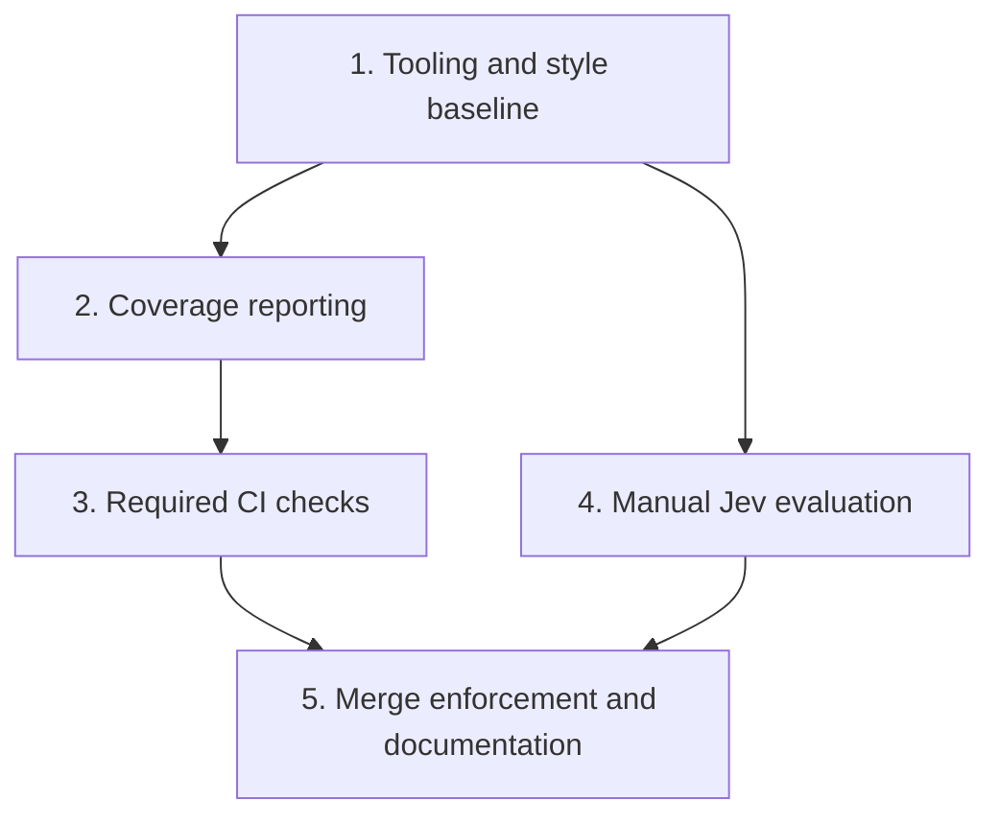

# CI and Code Quality

## Overview and Scope

Add GitHub Actions CI for Slop Guard's Ruby code, with required tests, non-metric static analysis, dependency auditing and fixture validation. Publish coverage and complexity measurements without numeric merge thresholds. Keep paid Jev development evaluations in a separate manual workflow.

This implements the practical baseline selected in the [origin requirements](../brainstorms/2026-09-19-ci-code-quality-requirements.md). Deployment, containers, publishing, hosting and GitHub App implementation remain separate tasks in `docs/plans/2026-09-19-001-feat-slop-guard-reviewer-plan.md`. No new type system, general analysis platform, automatic fixes, holdout tuning or model-quality merge gate is included.

Implementation is published in PR 1 on `feat/ci-code-quality`. Required checks and enforcement are live-verified; manual evaluation runtime acceptance remains after merge. See `docs/verification/ci-checkpoint.md` for current evidence and remaining hosted checks; the verified context below records the earlier planning baseline.

## Requirements Trace

| Origin | Decision | Units |
|---|---|---|
| R1 | PR and main-branch checks run without application credentials and expose failures | 3, 5 |
| R2 | Enforce the existing non-metric RuboCop rules, clean their baseline, add bundler-audit | 1, 3 |
| R3 | Validate fixtures offline while preserving deliberate fixture defects and labels | 1, 3 |
| R4 | Report line/branch coverage and complexity; values do not block merges | 2, 3 |
| R5 | Stable required checks, summaries, retained artifacts, local commands and verified enforcement | 3, 5 |
| R6 | Manual development evaluation, three repetitions, existing budgets and failure evidence | 4 |
| R7 | Restrict paid runs and their secret to trusted main; retain deliberate holdout qualification | 4, 5 |
| R8 | Deliver CI for the existing CLI independently of packaging, hosting and model qualification | All |

## Verified Context

- Target: `bornakapusta/slop-guard`, public, default branch `main`, not archived. The current GitHub identity has ADMIN access. Actions is enabled; actions are currently unrestricted and SHA pinning is not enforced by repository policy.
- GitHub API inspection found no rulesets, no environments, and `main` marked unprotected. These settings are a dated observation, not a promise that they remain unchanged until implementation.
- The checkout has no `.github/` workflows or `docs/solutions/` learnings. Existing evidence lives in `docs/verification/`.
- `.ruby-version` and `Gemfile.lock` specify Ruby 3.4.5; Bundler is locked to 2.7.2. Existing RSpec is 3.13 and RuboCop is locked to 1.91.0. The lockfile contains generic Ruby and macOS platforms; Linux installation remains to be verified during implementation.
- The preceding brainstorm measured 28 Ruby files and 274 RuboCop offenses: 64 Style, 118 Layout, one Bundler and 91 Metrics. Its recorded lint-only check passed. The most recent recorded test result is 47 passing examples; tests were not rerun for this plan.
- `spec/spec_helper.rb` loads `lib/slop_guard.rb` immediately; coverage must start before that load. `spec/slop_guard/cli_spec.rb` uses subprocesses, which the parent test process does not automatically measure.
- `bin/evaluate` supports offline validation and fresh live evaluation. Live quality mismatch exits 1; setup errors exit 2. `EvalRunner#run` atomically saves after each completed case, then adds aggregate metrics at completion. An interruption may leave useful case results without aggregate metrics; a failure before the first completed case may leave no report.
- `Budget` preserves request reservations in a JSONL ledger. Its defaults include $2 per evaluation session, $0.10 and 20 attempts per review, and a 120-second review deadline. A new invocation starts a new budget session.
- Evaluation versions fingerprint library source, rule content, dataset, profile, Ruby and the gem lockfile. Style cleanup and added gems invalidate exact-version reuse of earlier evaluation reports.

## Technical Decisions

### Workflow modes and result policy

| Workflow / job name | Trigger | Required for merge | Result policy |
|---|---|---|---|
| CI / Tests | Pull requests to main; pushes to main | Yes | RSpec failures and execution/setup failures fail the check; collect coverage without percentage thresholds |
| CI / Static analysis | Same | Yes | All enabled non-Metrics cops must pass |
| CI / Dependencies | Same | Yes | Vulnerability findings, insecure gem sources and advisory-update/tool errors fail |
| CI / Fixtures | Same | Yes | Existing offline validator must succeed |
| CI / Complexity | Same | No | Metric offenses are informational; execution errors visibly fail this optional job |
| Development evaluation / Jev development | Manual, main only | No | Preserve evaluation failure, incomplete execution and successful completion distinctly |

Use one Linux runner version, `ubuntu-24.04`, and the repository's Ruby/Bundler pins initially. A broader OS/Ruby matrix would add maintenance without a supported compatibility promise. Add a Linux lock platform only if the frozen install needs it, preserving unrelated resolved versions.

Use `pull_request`, not a privileged PR-target event. Run required jobs for all relevant PR changes, including documentation-only changes; avoid path filters that leave a required check pending. Give workflows read-only repository-content permissions and disable persisted checkout credentials. Use GitHub-hosted runners. New commits may cancel obsolete CI runs for the same PR; the newest revision must have its own successful checks. First-time fork runs may require GitHub's normal maintainer approval.

Pin external actions to full commits. Release metadata checked during planning:

| Action | Reference inspected | Commit |
|---|---|---|
| actions/checkout | v7.0.1 | `3d3c42e5aac5ba805825da76410c181273ba90b1` |
| actions/upload-artifact | v7.0.1 | `043fb46d1a93c77aae656e7c1c64a875d1fc6a0a` |
| ruby/setup-ruby | v1 branch at inspection | `a0102e0972be65f351c307e2d64b9314a57c8073` |

Recheck these references and runner requirements when implementing; keep a human-readable version comment beside each pin. Use setup-ruby's Bundler cache for ordinary CI only. Do not cache generated reports, credentials or evaluation ledgers. Paid evaluation installs from the lockfile without restoring caches supplied by other runs. [Action releases](https://github.com/actions/checkout/releases/tag/v7.0.1), [artifact action](https://github.com/actions/upload-artifact/releases/tag/v7.0.1), [Ruby setup](https://github.com/ruby/setup-ruby).

### Tool configuration and reports

Add `bundler-audit` 0.9.3 and SimpleCov 1.3.0 to the test/development tooling dependencies and lock their resolutions. The latter's tagged gemspec requires Ruby >= 3.3, compatible with this repo's 3.4 line. Use the tagged SimpleCov documentation rather than copying its older configuration API. The final Linux bundle resolution is an implementation check, not established by metadata inspection.

Keep `.rubocop.yml` authoritative with Metrics enabled. The required invocation excludes the Metrics department; the informational invocation selects Metrics. RuboCop also includes syntax checking in selected-cop mode. Normalize a metrics result as informational only when the completed JSON report contains solely metric offenses. Syntax findings, malformed/missing output, crashes and interruption remain execution failures. Installed RuboCop distinguishes success (0), offenses (1), and errors (2); do not hide all failures with unconditional success or job-wide error suppression.

Publish RSpec results, static-analysis/metrics JSON, dependency-audit JSON, fixture-validation JSON and coverage HTML/JSON with unique job/run artifact names and 14-day retention. Each job adds a short summary with its status and artifact reference. Upload only named report paths; never whole workspaces or all of `tmp/`. Reporting/upload errors remain visible. Measurement values are informational; a broken reporting tool is not a passing measurement.

Coverage is opt-in locally and enabled in the test job. Start it before reviewer code loads, include unloaded `lib/**/*.rb`, `script/**/*.rb` and Ruby entry points in `bin/`, and exclude specs, evaluation sources, dependencies and generated output. Report line and branch coverage with no minimum or maximum-drop policy. Keep subprocess execution uninstrumented in this initial phase and state that limitation; entry points must not silently disappear from the denominator. Do not introduce runtime coverage hooks into the reviewer to inflate a number. [SimpleCov 1.3.0 configuration](https://github.com/simplecov-ruby/simplecov/blob/v1.3.0/docs/Configuration.md), [startup and formatters](https://github.com/simplecov-ruby/simplecov/blob/v1.3.0/README.md).

### Paid evaluation boundary

Create a GitHub environment named `jev-evaluation` with a selected **branch** policy allowing only `main`, and no allowed tags or PR refs. Store `TYPESAFE_API_KEY` only as an environment secret for this workflow, not a repository-wide secret. This uses GitHub's environment access controls; it does not introduce application deployment.

The manual workflow has no ref, split, repetition or budget inputs. A preflight step rejects dispatch from any ref other than `refs/heads/main` before repository code or credentials are loaded; rejection must not appear as a successful evaluation. An allowed dispatch checks out its triggering immutable SHA. The environment restriction is required in addition to the workflow condition: a condition in branch-editable YAML alone is insufficient protection. Do not select “protected branches only”: with no protected branches that policy can admit every branch. [Environment restrictions](https://docs.github.com/en/actions/reference/workflows-and-actions/deployments-and-environments).

Expose the TypeSafe key only to the evaluation step after checkout and dependency installation. Missing credentials stop with a non-secret setup error. Run existing development cases three times, retain all budget/deadline guards, and never freeze versions or invoke holdout automatically. Use one repository-wide evaluation concurrency group, without cancelling an active paid run. A queued dispatch may be replaced by GitHub concurrency behavior; do not promise a durable queue. Each explicitly started run has its own $2 reservation cap, not a monthly/account spending cap. [Concurrency semantics](https://docs.github.com/en/actions/how-tos/write-workflows/choose-when-workflows-run/control-workflow-concurrency).

Limit the evaluation step to 15 minutes and the job to 20 minutes, reserving time for reporting. Attempt partial summary/artifact publication after normal errors and step timeouts, while preserving the evaluator's original exit status. Manual cancellation or runner loss can prevent final uploads; GitHub's cancelled/failed run remains authoritative and cannot establish qualification. Save completed case readings and the reservation ledger when available; reservations for interrupted requests may exceed costs inferable from completed case token counts.

## Implementation Units

- [x] **Unit 1: Establish tooling and a clean non-metric baseline**

**Requirements:** R2, R3, R8. **Dependencies:** None.

**Files:** Modify `Gemfile`, `Gemfile.lock`, `.rubocop.yml`, and only implicated Ruby files in `lib/`, `bin/`, `script/`, `spec/` and `Gemfile`. Reuse existing tests in `spec/slop_guard/` and `spec/eval/`.

**Approach:** Add the two selected gems without broad dependency upgrades. Preserve Metrics configuration and existing fixture/vendor/tmp exclusions. Include new Ruby tooling in the enforced scope and keep generated coverage outside it. Resolve the 183 recorded non-metric offenses through reviewed, behavior-preserving changes. Start with safe formatting corrections; review any non-automatic edits individually. Document narrowly justified individual exceptions; do not generate a blanket disabled-cop baseline. Preserve question strings, thresholds and dataset bytes.

**Patterns:** Existing RuboCop configuration; `spec/slop_guard/evaluator_spec.rb`, `spec/slop_guard/design_rules_spec.rb`, `spec/eval/fixture_contract_spec.rb` and CLI tests preserve behavior.

**Test expectation:** No new tests for formatting-only edits. Run the existing suite and offline fixture validation after cleanup. Add characterization coverage in the affected existing spec only if a proposed correction could alter behavior; prefer avoiding that behavioral refactor.

**Verification:** Frozen dependencies install on the intended runner; enforced non-metric rules pass; existing cases and tests retain their behavior. Metric offenses remain reported. Record the resulting baseline and preserve all prior evaluation artifacts as historical evidence.

- [x] **Unit 2: Add accurate coverage reporting without a coverage gate**

**Requirements:** R4, R5. **Dependencies:** Unit 1.

**Files:** Modify `spec/spec_helper.rb`; update `.gitignore` only if an output is not already ignored. Existing relevant test entry points: `spec/slop_guard/cli_spec.rb` and `spec/eval/runner_spec.rb`.

**Approach:** Put opt-in SimpleCov setup before the current application require. Keep configuration in this one test helper rather than introducing another runtime bootstrap. Produce HTML and machine-readable output with the scope and limitations above. Start each CI run from fresh results, avoiding cross-revision merge of previous coverage.

**Test expectation:** No new unit tests for library configuration. Verify the resulting artifact using a temporary unloaded Ruby file in the tracked scope, then remove that file; it must appear as uncovered. Verify one failing example still fails RSpec, ordinary local runs leave coverage disabled, and no fixture or vendor paths appear. Parent-process coverage must not be described as measuring exec-based CLI subprocesses.

**Verification:** A fresh CI-like suite run produces readable line/branch coverage for the intended source set; no numerical coverage value changes test success. Missing/broken coverage output is explicitly reported, not labeled a clean measurement.

- [x] **Unit 3: Add required CI and informational complexity results**

**Requirements:** R1–R5, R8. **Dependencies:** Units 1–2.

**Files:** Create `.github/workflows/ci.yml`. Use existing executable surfaces `bin/evaluate`, `.rspec` and `.rubocop.yml`; no new production review behavior is needed.

**Approach:** Implement the five jobs in the mode table with independent failures, stable job names and ten-minute job timeouts. Run the existing suite once with coverage. Refresh the advisory database before auditing the locked dependencies; network/update failures fail the audit check. Run offline validation over the complete fixture inventory without model requests; intentional omitted-context cases remain valid fixtures rather than being mistaken for validator failures. Use native tool reports and GitHub annotations, with small workflow-level summary steps instead of building a generic reporting framework.

**Patterns:** `bin/evaluate` validation contract; native RSpec/RuboCop output; `spec/eval/fixture_contract_spec.rb` distinguishes valid incomplete cases from malformed fixtures. [Audit tool behavior](https://github.com/rubysec/bundler-audit).

**Test expectation:** No RSpec tests that merely duplicate workflow YAML. Validate workflow syntax and exercise controlled workflow failures during implementation.

**Verification scenarios:**
- Happy path: a PR produces all four required successful checks and readable reports; Complexity completes with informational offenses.
- Failures: a failing spec, malformed Ruby file, non-metric offense, vulnerable dependency fixture, corrupted input preimage, or advisory refresh error fails its relevant check. Do not commit a vulnerable dependency into the real lockfile for this test.
- Metrics: ordinary metric offenses remain informational; invalid configuration, syntax findings and absent JSON surface as tool failures.
- Integration: a documentation-only PR still receives required checks; a fork PR runs without application secrets; a newer commit gets fresh checks after cancellation of an older run.
- Reporting: failures retain available reports, fresh artifacts do not contain `.env` or old evaluation files, and report/upload failures are visible.

**Verification:** Observe actual GitHub check names, artifacts and failure statuses before configuring required-check enforcement. If a fork contribution cannot be exercised, document it as not live-verified rather than claiming it from local YAML inspection.

- [ ] **Unit 4: Add trusted manual development evaluation**

Implementation, local tests, environment policy and PR-ref rejection are verified. Allowed-main dispatch and timeout acceptance remain pending default-branch merge; see the checkpoint.

**Requirements:** R6, R7. **Dependencies:** Unit 1. Configure the main-only evaluation environment within this unit before supplying real credentials or attempting its hosted verification.

**Files:** Create `.github/workflows/evaluate.yml`, `script/evaluation_summary.rb`, and `spec/ci/evaluation_summary_spec.rb`. External configuration: the `jev-evaluation` environment, its branch restriction and environment-scoped secret. Reuse `bin/evaluate`, `lib/slop_guard/eval_runner.rb` and `lib/slop_guard/budget.rb` without changing their judgment or budget policies.

**Approach:** Follow the paid-run boundary above. Establish and verify the environment restriction first; document secret rotation there, and check for repository-level duplicates without printing values. No reviewer-approval gate is needed beyond manual dispatch. Add one focused summary renderer for the existing report/ledger formats. It reports completed versus expected case/repeat pairs, per-rule metrics and variability when finalized, provisional-label status, version identifiers, token-derived cost estimates and reserved budget. Determine completion from the exact expected case/repeat inventory, finalized metrics and evaluator status together; a report containing 48 rows alone is insufficient. For partial data, label available values as partial and do not fabricate final metrics or a pass. No report means “evaluation did not produce a report,” not zero violations. Malformed input is a reporting failure. Render data as escaped text and never execute file content. Preserve raw reports as the evidence of record.

**Patterns:** `EvalRunner#save` atomic per-case output; `Report.escape` for untrusted text presentation; CLI exit handling; `spec/eval/metrics_spec.rb` distinction between semantic failures and provider failures.

**Test scenarios in `spec/ci/evaluation_summary_spec.rb`:** A complete passing synthetic report; complete mismatching report; provider failure; duplicate/missing case-repeat pair; missing or malformed report; interruption after a few cases with no final metrics; reserved requests beyond completed token usage; and labels still provisional. The renderer must never turn an incomplete or failed run into qualification. Use sanitized test data and no provider calls.

**Integration verification:** An allowed main dispatch reaches the existing evaluator and preserves its success/mismatch/setup exit behavior. A non-main dispatch or tag cannot obtain the environment secret even if its workflow condition is changed. Missing secret fails before provider requests. Controlled evaluator failure and step timeout retain available artifacts; runner loss/cancellation is recorded as a limitation. Concurrent dispatches do not overlap active paid evaluations. Do not execute a paid smoke run as part of planning.

- [x] **Unit 5: Enable enforcement and document operation**

**Requirements:** R5–R8. **Dependencies:** Units 3–4.

**Files:** Create `docs/ci.md` and `docs/verification/ci-checkpoint.md`; update `README.md`, `AGENTS.md` and `docs/evaluation.md`. External configuration: main-branch ruleset and verification of the evaluation environment created in Unit 4; these settings are not supplied by YAML alone.

**Approach:** First obtain real successful CI runs so exact check contexts can be selected. Configure an active main-branch ruleset requiring PRs and the four required GitHub Actions checks, with no routine bypass, and require the latest PR state to be tested against main. Do not add mandatory human review counts for this individual-maintainer repo. Select the checks by their observed names and source integration; exclude Complexity and Jev development. Verify a deliberately failing required check prevents merge and that failed optional evaluation does not.

Recheck the evaluation environment's main-only branch restriction and secret scope established in Unit 4. If account settings or access prevent enforcement, leave a precise administrator action and mark enforcement not verified. Without that credential boundary, keep live CI unconfigured; required code-quality CI can still be delivered.

Document local equivalents, trigger behavior, job meanings, reporting limitations, artifact retention, default-branch/environment setup, per-run spending limits and interruption behavior. Update evaluation docs to distinguish local commands from the new manual workflow. Preserve the general-purpose product scope and the failed model-quality baseline. Coverage percentages establish execution, not feature-use-case adequacy.

**Test expectation:** No tests for prose. Actual GitHub settings and workflow behavior require live verification; inspecting configuration alone is insufficient.

**Verification:** The checkpoint records commit SHA, workflow run/PR URLs, tool versions, observed check contexts, fork/security boundary checks, artifact checks and enforcement status. Report each item as verified, failed or not verified, and keep model quality separate. Record any remaining operator setup explicitly.

## Risk and Failure Handling

| Risk | Treatment |
|---|---|
| Style cleanup affects evaluator behavior or question content | Review diffs, preserve inputs, rerun existing tests; defer unrelated refactors |
| Historical evidence appears current after fingerprint changes | Preserve old reports; require fresh same-version evaluation for any new qualification claim |
| PR code acquires a paid-service credential | Ordinary PR events, read-only token, no application secrets; server-side main-only environment for paid runs |
| Metrics/configuration errors are hidden as informational findings | Validate completed report and result class; accept only actual metric offenses as non-blocking |
| Coverage excludes unloaded files or overstates subprocess coverage | Explicit source inventory, early startup and documented process boundary |
| Cancellation leaves incomplete data or no artifact | Atomic existing per-case reports, cleanup time, partial summary and explicit runner-loss limitation |
| A green workflow is mistaken for merge enforcement | Verify GitHub ruleset against real failing/passing PR checks |
| Audit feed changes or is unavailable | Treat it as an explicit audit result/error; no silent stale-cache success or blanket advisory ignores |

## System Impact and Deferred Implementation Checks

Contributors gain PR checks and maintainers gain a manual evaluation entry point. Test-only instrumentation changes the test process, while formatting and lockfile updates can change evaluation fingerprints. There is no runtime server or new persistence service. Artifacts are disposable reports; evaluation ledgers remain per-run evidence, not cross-run accounting.

Planning resolved workflow scope, trigger and trust boundaries, main/public/admin availability, dependency candidates, check policy, artifact retention and sequencing. Implementation must establish the Linux dependency resolution, safe cleanup details, coverage baseline, hosted action behavior, exact required check contexts and actual enforcement. Revalidate action commit provenance and repository settings before applying them. These are execution checks, not unresolved product decisions.

## Sources

- [Origin requirements](../brainstorms/2026-09-19-ci-code-quality-requirements.md).
- Existing contracts: `AGENTS.md`, `.rubocop.yml`, `spec/spec_helper.rb`, `bin/evaluate`, `lib/slop_guard/eval_runner.rb`, `lib/slop_guard/budget.rb`, `docs/evaluation.md`, `docs/verification/threshold-calibration.md`.
- [GitHub workflow syntax and permissions](https://docs.github.com/en/actions/reference/workflows-and-actions/workflow-syntax), [secret handling](https://docs.github.com/en/actions/how-tos/write-workflows/choose-what-workflows-do/use-secrets), [protected branches](https://docs.github.com/en/repositories/configuring-branches-and-merges-in-your-repository/managing-protected-branches/about-protected-branches).
- [bundler-audit 0.9.3 metadata](https://rubygems.org/gems/bundler-audit/versions/0.9.3), [SimpleCov 1.3.0](https://rubygems.org/gems/simplecov/versions/1.3.0).
- Read-only GitHub API inspection on 2026-09-19: repository metadata, main branch protection, rulesets, Actions permissions, environments and official action release/commit metadata.
